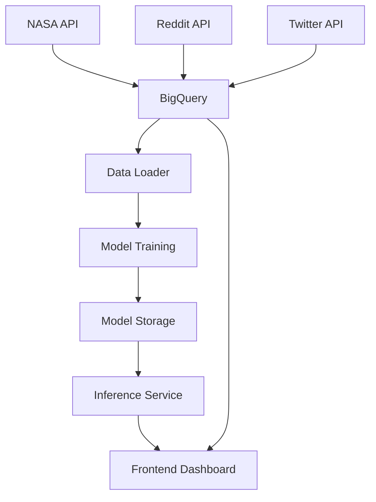

# UFO Activity Prediction System

A comprehensive data engineering project that collects, processes, and predicts UFO-related activity across multiple social media platforms using machine learning.

## 🚀 Project Overview

This system monitors UFO-related discussions across NASA, Reddit, and Twitter platforms, processes the data through a machine learning pipeline, and provides interactive visualizations to track and predict UFO activity patterns.

## 🏗️ Architecture

The project is organized into three main components:

### 📡 Data Fetchers (`fetchers/`)
- **NASA API**: Collects Near Earth Object data from NASA's API
- **Reddit API**: Monitors r/ufo subreddit for UFO-related posts
- **Twitter API**: Tracks UFO-related hashtags and tweets

### 🤖 Machine Learning (`models/`)
- **C-Models** (`c_models/`):
  - **Data Loader**: Loads training data from BigQuery
  - **Model Training**: Trains Random Forest regression models
  - **Inference Service**: Serves predictions via REST API
- **J-Models** (`j_models/`):
  - **ElasticNet Regression**: Linear regression with L1/L2 regularization
  - **Lasso Regression**: L1 regularized linear regression
  - **Ridge Regression**: L2 regularized linear regression

### 🎨 Frontend (`frontend/`)
- **Streamlit App**: Data exploration interface
- **Flask Dashboard**: Interactive visualization with ML predictions

## ✨ Key Features

- **Multi-Source Data Collection**: Automated data fetching from NASA, Reddit, and Twitter
- **Machine Learning Pipeline**: Multiple ML approaches including Random Forest and ElasticNet regression
- **Real-time Predictions**: REST API for live inference
- **Interactive Visualizations**: Side-by-side comparison of actual vs. predicted values
- **Cloud Integration**: BigQuery for data storage, GCS for model persistence
- **Scalable Architecture**: Microservices design with Docker support

## 🛠️ Technology Stack

- **Languages**: Python 3.13+
- **ML Framework**: scikit-learn (Random Forest, ElasticNet, Lasso, Ridge)
- **Web Frameworks**: Flask, Streamlit
- **Cloud Platform**: Google Cloud Platform
- **Data Storage**: BigQuery, Google Cloud Storage
- **APIs**: NASA API, Reddit API (PRAW), Twitter API (Tweepy)
- **Visualization**: Plotly
- **Package Management**: uv

## 🚀 Quick Start

### Prerequisites
- Python 3.13+
- uv package manager
- Google Cloud Platform account
- API keys for NASA, Reddit, and Twitter

### Installation

1. Clone the repository:
   ```bash
   git clone <repository-url>
   cd DE_Project_Group
   ```

2. Install dependencies:
   ```bash
   uv sync
   ```

3. Set up environment variables:
   ```bash
   # Create .env file with your credentials
   export NASA_API="your_nasa_api_key"
   export REDDIT_CLIENT_ID="your_reddit_client_id"
   export REDDIT_CLIENT_SECRET="your_reddit_client_secret"
   export X_BEARER="your_twitter_bearer_token"
   export GOOGLE_CLOUD_PROJECT="your_gcp_project"
   export GOOGLE_APPLICATION_CREDENTIALS="path/to/service_account.json"
   ```

### Running the System

1. **Start Data Fetchers**:
   ```bash
   # NASA API
   cd fetchers/nasa_api && uv run python nasa_api.py
   
   # Reddit API
   cd fetchers/reddit_api && uv run python reddit_api.py
   
   # Twitter API
   cd fetchers/twitter_api && uv run python twitter_api.py
   ```

2. **Train ML Models**:
   ```bash
   # C-Models (Random Forest)
   cd models/c_models/models && uv run python main.py
   
   # J-Models (ElasticNet, Lasso, Ridge)
   cd models/j_models/elasticnet_regression && uv run python model.py
   cd models/j_models/lasso_regression && uv run python model.py
   cd models/j_models/ridge_regression && uv run python model.py
   ```

3. **Start Inference Service**:
   ```bash
   cd models/c_models/inference && uv run python main.py
   ```

4. **Launch Frontend**:
   ```bash
   # Streamlit app
   cd frontend && uv run streamlit run streamlit_app.py
   
   # Flask dashboard
   cd frontend/flask_app && uv run python main.py
   ```

## 📊 Data Flow



## 🔧 Configuration

### Environment Variables

| Variable | Description | Required |
|----------|-------------|----------|
| `NASA_API` | NASA API key | Yes |
| `REDDIT_CLIENT_ID` | Reddit API client ID | Yes |
| `REDDIT_CLIENT_SECRET` | Reddit API client secret | Yes |
| `X_BEARER` | Twitter API bearer token | Yes |
| `GOOGLE_CLOUD_PROJECT` | GCP project ID | Yes |
| `GOOGLE_APPLICATION_CREDENTIALS` | Service account key path | Yes |
| `GCS_MODEL_BUCKET` | GCS bucket for models | Yes |
| `BIGQUERY_TABLE` | BigQuery table for data | Yes |

### API Setup

1. **NASA API**: Get free API key from [api.nasa.gov](https://api.nasa.gov/)
2. **Reddit API**: Create app at [reddit.com/prefs/apps](https://www.reddit.com/prefs/apps)
3. **Twitter API**: Apply for developer access at [developer.twitter.com](https://developer.twitter.com/)

## 📁 Project Structure

```
DE_Project_Group/
├── fetchers/                 # Data collection services
│   ├── nasa_api/            # NASA Near Earth Objects
│   ├── reddit_api/          # Reddit UFO discussions
│   └── twitter_api/         # Twitter UFO hashtags
├── models/                  # ML pipeline
│   ├── c_models/           # Random Forest models
│   │   ├── data_loader/    # BigQuery data loading
│   │   ├── models/         # Model training
│   │   └── inference/      # Prediction API
│   └── j_models/           # Linear regression models
│       ├── elasticnet_regression/
│       ├── lasso_regression/
│       └── ridge_regression/
├── frontend/                # Visualization interfaces
│   ├── streamlit_app.py     # Data exploration
│   └── flask_app/           # Interactive dashboard
└── docs/                    # Documentation
```

## 🎯 Use Cases

- **UFO Activity Monitoring**: Track discussions across platforms
- **Trend Analysis**: Identify patterns in UFO-related content
- **Predictive Analytics**: Forecast future activity levels with multiple ML approaches
- **Research Support**: Data-driven insights for UFO research
- **Social Media Intelligence**: Understand public interest in UFOs

## 🔍 API Endpoints

### Data Fetchers
- `GET /` - Fetch and upload data
- `GET /health` - Health check

### ML Inference
- `GET /` - Health check
- `GET /predict` - Get predictions (NDJSON)
- `GET /predict-and-upload` - Predict and upload to GCS

### Frontend
- `GET /` - Interactive dashboard
- `GET /health` - Health check

## 🚀 Deployment

The system supports cloud deployment with:
- **Docker**: Containerized services
- **Google Cloud Build**: CI/CD pipeline
- **Cloud Run**: Serverless deployment
- **BigQuery**: Data warehouse
- **Cloud Storage**: Model and data persistence

## 📈 Monitoring

- Comprehensive logging across all services
- Health check endpoints for monitoring
- Error handling with detailed messages
- Timestamped model versions for tracking

## 🤝 Contributing

1. Fork the repository
2. Create a feature branch
3. Make your changes
4. Run tests and linting: `uv run ruff check .`
5. Submit a pull request

## 📄 License

This project is part of a data engineering course at ITHS.

## 👥 Team

Developed by the best group! 🎉

---

**Note**: This system is designed for educational and research purposes. Ensure compliance with API terms of service and data usage policies.
